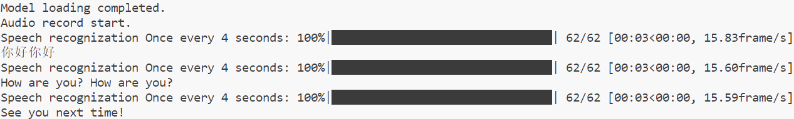

# whisper-loop


## Introduce

项目功能为使用pyaudio实时录音并使用whisper语音识别




## Usage

```
# windows
# 安装 ffmpeg
python .\scripts\win_install_ffmpeg.py # 以管理员权限运行
# 运行代码
git submodule update --recursive --init
pip install -r requirements.txt
python main.py
```